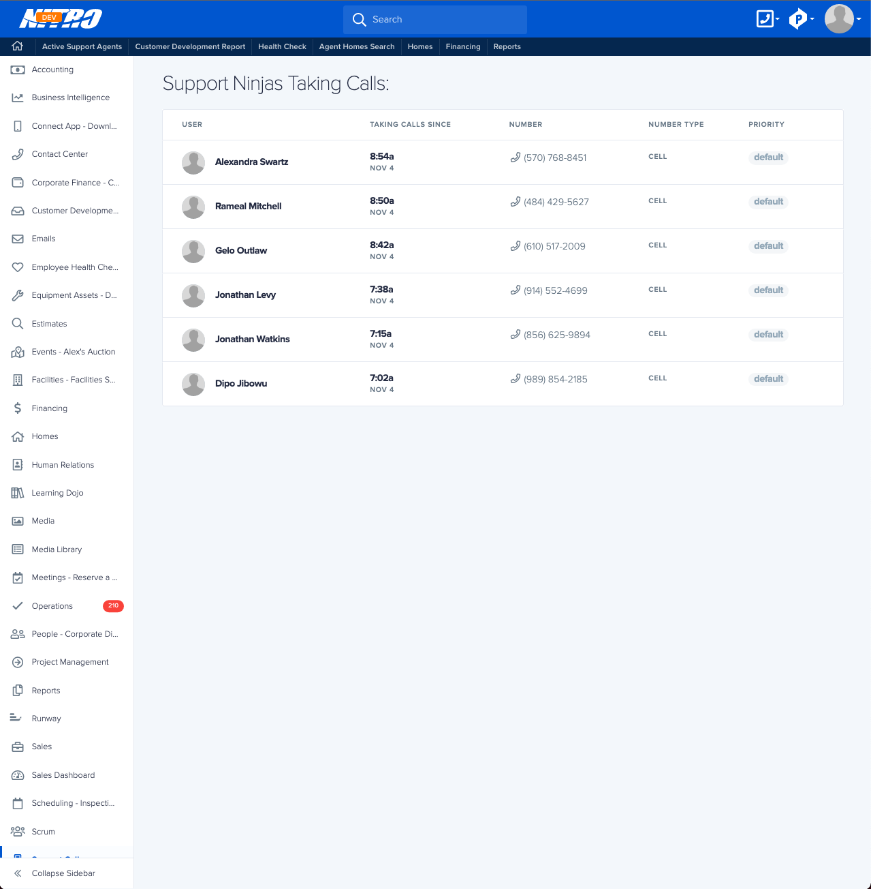
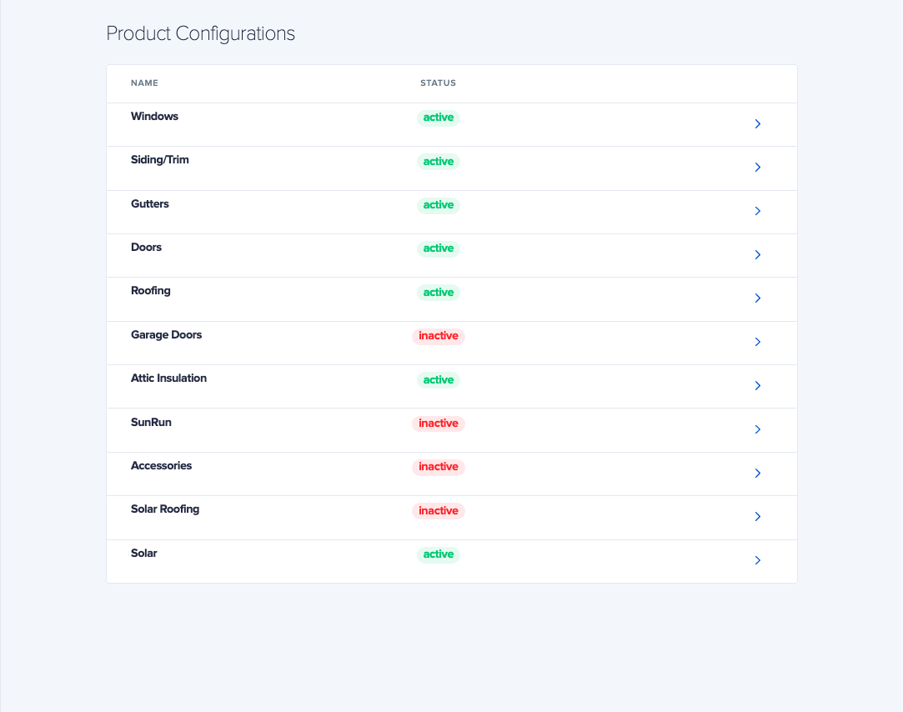
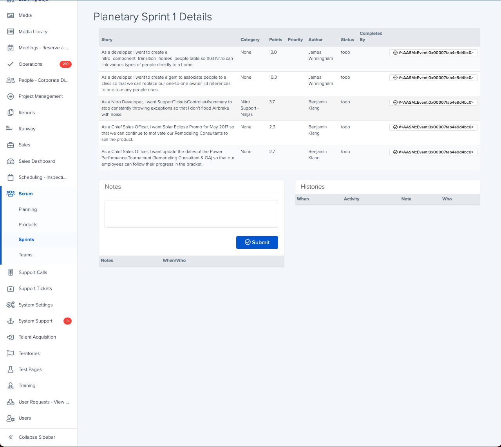
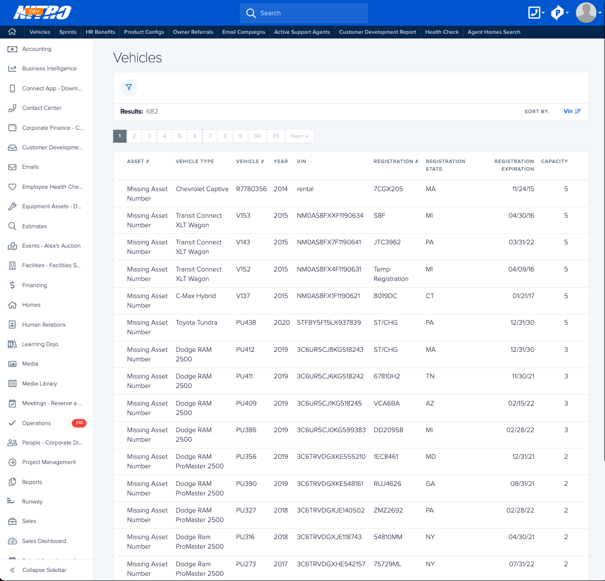

# Nitro Scavenger Hunt 2

1. Using [localhost:3000/graphql/try](localhost:3000/graphql/try) in Nitro, find the 6th letter of name for the 4th result in `accessoryTypes`.

2. In the following page, the data is queried in a certain order. What is the 2nd letter of the direction by which this data is ordered?

3. What is the 7th letter of the title of the role for the 5th `User` in the database?

4. Find the file that uses the `payPeriods`/`PAY_PERIODS` query. What is the 8th letter of the name of that component?

5. Using [localhost:3000/graphql/try](localhost:3000/graphql/try) in Nitro, find the `learningDojoCourse` and grab the first letter of the 15th field.

6. Find the erb file for the following page and count how many **unique** playbook kits are used on this page. What is the 2nd letter of that number?

7. Using `User.nitro`'s id, find the 1st `FeatureToggle` with the matching `created_by_id`. What is the 5th letter of the name of that feature toggle?

8. How many components use the `apmAddBacklogItem` mutation? What is the 1st letter of that number? Hint: The mutation is stored in a gql constant that is exported to these components.

9. Using [localhost:3000/graphql/try](localhost:3000/graphql/try) in Nitro, find the 2nd letter of name for the 1st result in `departments`.

10. Find the erb file for the following page. What is 1st letter of the class for the 1st `div` used on this file?

11. What is the 1st letter of the city of the 1st `Home` in Nitro?

12. What is the name of the component that uses the `confirmationCallControlSearch` query? What is the 7th letter of that component?

13. What is the name of the function that uses the `trackBuildMetrics` mutation? What is the 16th letter of that function?

14. Using [localhost:3000/graphql/try](localhost:3000/graphql/try) in Nitro, find the last letter of name for the last result in `companies`.

15. Find the model used for the page below. What is the 10th letter (11th character) of the `belongs_to` for that model?

Unscrable the letters to find the secret phrase when you're finished!

\_ \_ \_ \_ \_ &nbsp;&nbsp; \_ \_ \_ \_ \_ &nbsp;&nbsp; \_ \_ &nbsp;&nbsp; \_ \_ \_